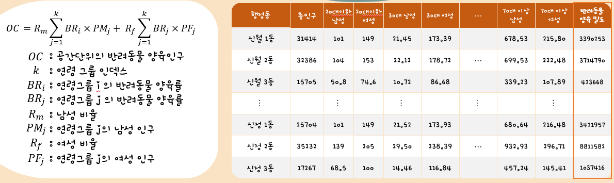
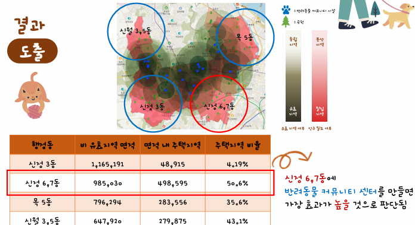

# 선도소프트 공간융합 빅데이터 아이디어 경진대회 - 우수상

 

## 프로젝트 주제
GIS 데이터를 이용한 애견 관련 사업 진단 데이터

 

## 프로젝트 기간
| 구분 | 기간 | 총 기간 | 비고 |
| -- | -- | -- | -- |
| 전체 기간 | 2023.10.01 ~ 2023.11.27 | 2개월 |  |
| 서류 | 2023.10.01 ~ 2023.11.17 | 1개월 | 제안서 서류 평가 |
| 본선 | 2023.11.22 ~ 2023.11.27 | 5일 | Mclp를 활용한 반려동물 커뮤니티 최적의 센터 선정 |

 

## 팀원 소개

| 이름   | 직위                  | 역할                       |
|---------|------------------------|-----------------------------|
|  류준형  | 팀장     | 주제 방향성 선정 및 발표  |
| 김건호   | 팀원    | GIS 데이터 전처리 및 Mclp 모델링         |
| 김수환   | 팀원   | PPT 제작            |

 

## 분석

 

## 진단 결과

## 느낀점
처음 해 본 데이터 분석 프로젝트였습니다. 공간 데이터라는 GIS 데이터를 이용해 봤는데 생각보다 재미있고 도움되는 경험이었습니다.

확실하게 배운 점 한가지는 아무리 어려워도 해당 원리를 파악하면 해결의 실마리가 보인다는 것입니다. 처음에는 GIS 데이터를 보는 툴도 제대로 못 설치해서 힘들었지만 하나하나씩 어려움을 극복하고 데이터 원리를 파악하며 나아갔습니다. 수상한 것은 이러한 노력에 대한 보상이라고 생각합니다.

